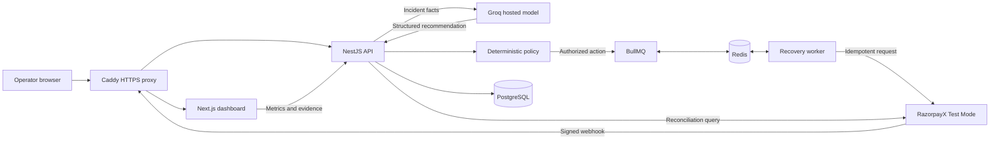

# RecoveryOS

### [Open the live demo](https://razorpay-recovery.duckdns.org)

**RecoveryOS is an AI-assisted system for recovering failed payments and payouts without allowing an AI model to move money on its own.**

In simple terms: when money gets stuck, RecoveryOS studies what happened and recommends the next step. Fixed safety rules then decide whether the system may retry automatically, must ask a person, should wait for Razorpay to confirm the result, or must stop. Every event, recommendation, decision and action is saved so the final recovery number can be checked.

> The public deployment is a portfolio and evaluation environment. It uses synthetic scenarios and RazorpayX Test Mode. No real money moves through the guided demo.

## Why this project exists

A normal failure dashboard tells an operator that a transaction failed. That still leaves the difficult questions:

- Is a retry safe?
- Could the first request still complete and cause a duplicate?
- Does the customer or beneficiary need to fix something?
- Is human approval required because the amount is high?
- Did this system actually recover the money, or did the transaction complete naturally?

RecoveryOS turns those questions into a controlled workflow. AI handles diagnosis and proposes an action; deterministic policy remains the authorization boundary.

## What it demonstrates

- **Inbound revenue recovery:** evaluates failed card, mandate and checkout cases against a fixed eight-case cohort.
- **Payout recovery:** handles temporary failures, amount limits, invalid beneficiaries and ambiguous provider states.
- **Hosted AI advice:** Groq GPT-OSS 120B returns schema-validated categories, evidence and proposed actions.
- **Deterministic authorization:** versioned rules independently authorize, require approval, escalate or stop.
- **Durable execution:** BullMQ and Redis preserve delayed jobs and worker actions across restarts.
- **Duplicate protection:** webhook deduplication, durable action records and idempotency keys prevent blind replay.
- **Provider confirmation:** a payout is counted as recovered only after linked terminal evidence.
- **Human controls:** role-based access, remediation and maker-checker approval protect exceptional cases.
- **Traceable evidence:** live metrics, immutable experiment snapshots, audit timelines and CSV/JSON exports.

## How it works



1. Razorpay sends a signed event, or a controlled demo creates the same kind of incident.
2. The API verifies and stores the event. Replaying the same event does not create another incident.
3. The AI receives bounded incident facts and returns a structured recommendation. Malformed or unavailable AI output cannot create a financial action.
4. Versioned policy checks the provider state, amount, retry count, duplicate risk and approval requirements.
5. An authorized action is written to PostgreSQL before it enters the Redis-backed queue.
6. A worker performs the action with an idempotency key.
7. A signed webhook or reconciliation confirms the provider's terminal result before the incident becomes recovered.
8. Dashboard totals are calculated from linked actions and evidence; immutable snapshots remain unchanged.

## Dashboard guide

| Page | Purpose |
|---|---|
| **Overview** | Account-wide recovered value, open risk, intervention counts and inbound-recovery experiments. |
| **Payout queue** | Search and filter payout incidents, inspect AI and policy evidence, approve or reject bounded retries, record remediation and reconcile uncertain outcomes. |
| **Evidence** | Inspect current linked outcomes alongside frozen creation-time snapshots and download CSV/JSON evidence. |
| **Guided demo** | Run four hosted-AI scenarios or the separately guarded ₹10,000 RazorpayX Test Mode demonstration. |
| **Policy** | View or activate a new version of the retry limit, autonomous amount cap and minimum delay. |
| **Operations** | Check PostgreSQL, Redis, worker queues, AI configuration, simulation safety and provider-demo readiness. |

## Technology

| Layer | Technology |
|---|---|
| Web application | Next.js 15, React 19, TypeScript |
| API and workers | NestJS, TypeScript |
| Database | PostgreSQL, Prisma |
| Job queue | Redis, BullMQ |
| AI provider | Groq through an OpenAI-compatible client; GPT-OSS 120B by default |
| Payment provider | Razorpay and RazorpayX Test Mode |
| Production hosting | Docker Compose on AWS EC2, Caddy TLS proxy |
| Validation | Jest, Zod, Prisma migrations, contract and fault tests |

## Install and run locally

### Prerequisites

- Git
- Node.js 22 or newer
- Corepack, included with compatible Node.js installations
- Docker Desktop for the easiest PostgreSQL and Redis setup

### 1. Clone the repository

```bash
git clone https://github.com/ABHINAVGUSAIN10/recoveryos.git
cd recoveryos
```

### 2. Enable the repository's pnpm version

```bash
corepack enable
corepack prepare pnpm@11.19.0 --activate
pnpm --version
```

If PowerShell still cannot find `pnpm`, close and reopen the terminal after enabling Corepack.

### 3. Create the local environment file

Windows PowerShell:

```powershell
Copy-Item .env.example .env
```

macOS or Linux:

```bash
cp .env.example .env
```

The checked-in example is configured for local Docker services and safe simulation. Do not commit `.env` or place credentials in screenshots or logs.

### 4. Start PostgreSQL and Redis

```bash
docker compose up -d postgres redis
docker compose ps
```

### 5. Install dependencies

```bash
pnpm install --frozen-lockfile
```

### 6. Prepare the database

```bash
pnpm db:generate
pnpm db:push
```

`db:push` is intended for local development. The production deployment uses checked-in Prisma migrations.

### 7. Seed the reproducible payout cohort

```bash
pnpm simulate
```

This creates deterministic demonstration data without consuming hosted-model quota.

### 8. Start the API and dashboard

```bash
pnpm dev
```

Open:

- Dashboard: [http://localhost:3000](http://localhost:3000)
- API health: [http://localhost:3001/health](http://localhost:3001/health)
- Dependency readiness: [http://localhost:3001/api/v1/ready](http://localhost:3001/api/v1/ready)

Stop the development processes with `Ctrl+C`. Stop local infrastructure with:

```bash
docker compose down
```

The PostgreSQL data volume is preserved unless it is explicitly removed.

## Windows setup without Docker or WSL

The applications can run directly in Windows while PostgreSQL and Redis are hosted:

1. Create a development PostgreSQL database, for example in Neon.
2. Put its TLS connection string in `DATABASE_URL`; keep `sslmode=require` when the provider requires it.
3. Create a Redis database, for example in Upstash.
4. Put the Redis protocol URL in `REDIS_URL`. Use the `rediss://` URL on port `6379`, not the REST API URL.
5. Keep only synthetic development data in these services.
6. Run the install, database, simulation and development commands from the previous section, skipping `docker compose up`.

BullMQ polls Redis while the API is running. Pause the local API when it is not being used if the hosted Redis plan has a small command allowance.

## Optional AI configuration

The deterministic simulator works without an AI key. To exercise the hosted advisory path, add an OpenAI-compatible provider to your private `.env`:

```dotenv
AI_PROVIDER="groq"
AI_API_KEY="your-private-key"
AI_BASE_URL="https://api.groq.com/openai/v1"
AI_MODEL="openai/gpt-oss-120b"
AI_THINKING_MODE="disabled"
```

Then enable only the demonstration you intend to run:

```dotenv
ENABLE_LIVE_DEMO="true"
ENABLE_REVENUE_DEMO="true"
SIMULATION_MODE="true"
```

Restart `pnpm dev` after changing environment variables. If the hosted model times out or returns invalid output, RecoveryOS fails closed and creates no financial action.

Evaluate the advisory contract without contacting the provider:

```bash
pnpm ai:evaluate
pnpm ai:evaluate:revenue
```

Require actual hosted-model responses only after privately configuring a key:

```bash
pnpm ai:evaluate -- --require-live
pnpm ai:evaluate:revenue -- --require-live
```

## RazorpayX Test Mode demonstration

The provider-backed presenter action is intentionally separate from ordinary simulation. It requires:

- `AUTH_MODE=token` and an administrator token
- A RazorpayX **Test Mode** `rzp_test_` key pair
- A webhook secret
- A dedicated active Test Mode fund account
- At least ₹10,000 of dummy Test Mode balance
- `ENABLE_RAZORPAYX_TEST_DEMO=true`
- `SIMULATION_MODE=true`

The server fixes the amount at ₹10,000, refuses live credentials, applies a cooldown and uses a durable idempotency key. RazorpayX may initially leave the payout in `processing`; RecoveryOS waits for a terminal webhook or reconciliation and does not create a fresh payout while the result is uncertain.

See [the demo runbook](docs/demo-runbook.md) for the complete guarded setup and presentation flow.

## Authentication and roles

Local simulation defaults to `AUTH_MODE=disabled`, which supplies a synthetic administrator session. Hosted environments should use `AUTH_MODE=token` with independent high-entropy credentials:

| Role | Access |
|---|---|
| Viewer | Read incidents, policies, batches and evidence. |
| Operator | Viewer access plus review decisions and batch creation. |
| Administrator | Operator access plus policy activation, reconciliation and provider demo controls. |

The dashboard keeps the supplied token in browser session storage. Never commit or publish these values.

## Verification commands

```bash
pnpm test
pnpm build
pnpm db:validate
```

With the API running in simulation mode, the signed-webhook acceptance flow also verifies duplicate delivery and evidence export:

```bash
pnpm acceptance:webhook
```

The suite covers policy rules, state transitions, schema validation, webhook deduplication, maker-checker approval, queue and worker faults, execution uncertainty, reconciliation, financial attribution and metric consistency.

## Safety rules

- All money values are stored as integer paise.
- AI output is advisory and schema-validated; deterministic policy is authoritative.
- Duplicate webhook deliveries are no-ops.
- Processing, unknown, duplicate-suspected and exhausted incidents cannot be blindly retried.
- A provider timeout becomes `EXECUTION_UNKNOWN` and requires reconciliation.
- Payout escalation requires validated remediation and approval by a different actor.
- Recovered value requires a linked successful RecoveryOS action and provider evidence.
- Raw ledgers, audit events and immutable experiment results are protected by append-only database triggers.
- Secrets, request bodies, authorization headers and connection strings are excluded from structured request logs.

## Evidence and limitations

- Synthetic batches are controlled evaluations, not claims of production causal lift.
- The RazorpayX integration moves only dummy Test Mode balance in the presenter workflow.
- A manually advanced RazorpayX Test Mode state is a provider-sandbox requirement, not a human approval inside the RecoveryOS decision path.
- Live operational totals can change as incidents resolve; frozen experiment snapshots and exports do not change.
- Production real-money execution remains fail-closed and requires a separate security, compliance and operational review.

## Project structure

```text
apps/web                 Next.js operator dashboard
apps/api                 NestJS API, workers, provider adapters and Prisma schema
packages/domain          Shared schemas, state transitions and deterministic policy
docs                     Architecture, policy, operations, deployment and demo guides
deploy/Caddyfile         Production HTTPS and reverse-proxy configuration
docker-compose.yml       Local PostgreSQL, Redis, API and web stack
docker-compose.production.yml
                         Hardened EC2 deployment stack
```

## Documentation

- [Architecture](docs/architecture.md)
- [Revenue-recovery design and experiment limits](docs/revenue-recovery.md)
- [Policy rules](docs/policy.md)
- [Demo runbook](docs/demo-runbook.md)
- [Operations and fault verification](docs/operations.md)
- [Production deployment](docs/deployment.md)
- [Security policy](SECURITY.md)
- [Redacted RazorpayX webhook evidence](docs/evidence/razorpayx-test-webhook-20260826.json)

## Deployment

The live demo runs as Docker containers on AWS EC2 behind Caddy-managed TLS. The API applies checked-in Prisma migrations at startup, and production Redis is private to the Compose network. Deployment instructions are in [docs/deployment.md](docs/deployment.md).

## Security

Please do not publish vulnerabilities or credentials in a GitHub issue. Follow [SECURITY.md](SECURITY.md) for responsible reporting and supported-environment information.

## License

No open-source license has been selected yet. Public repository visibility does not grant permission to reuse, modify or redistribute the code. Add a recognized license before accepting external reuse or contributions.
